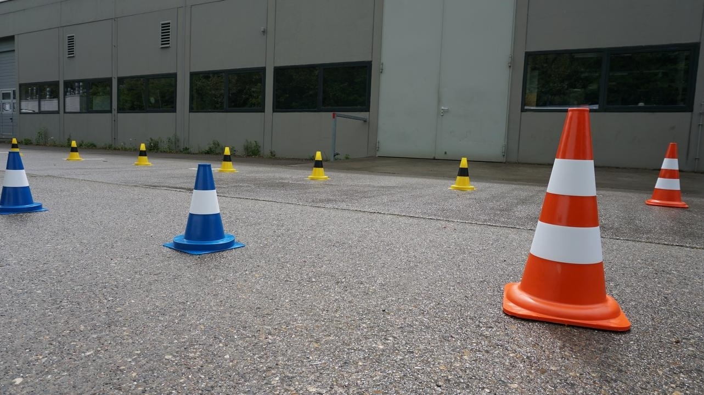
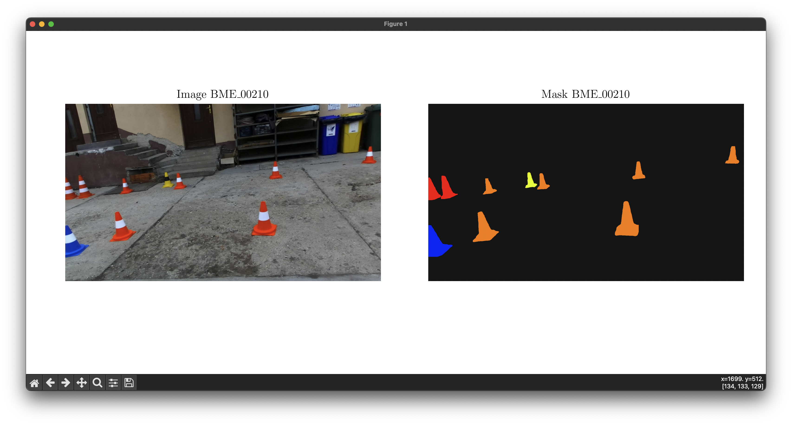
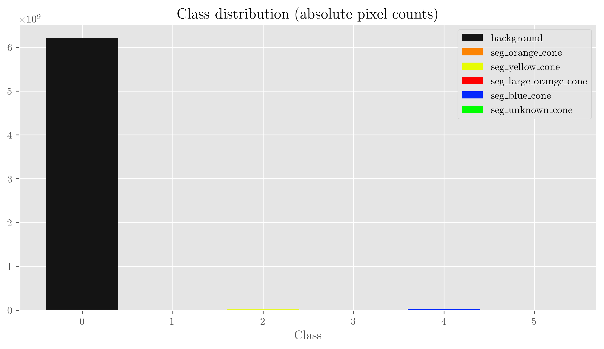
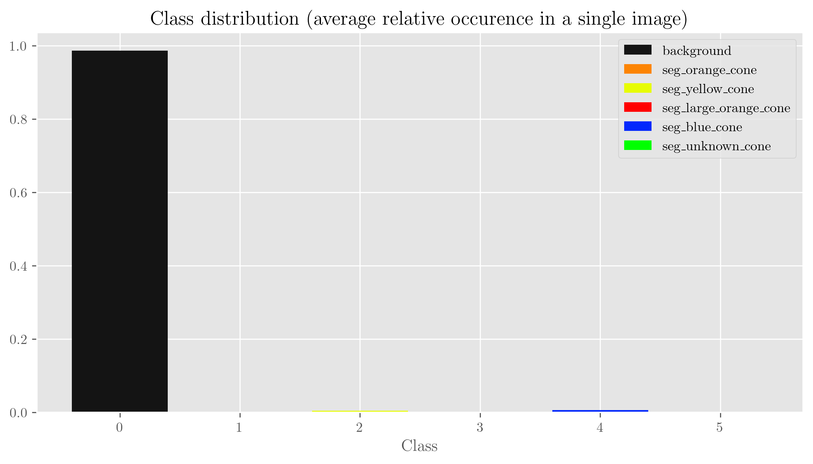
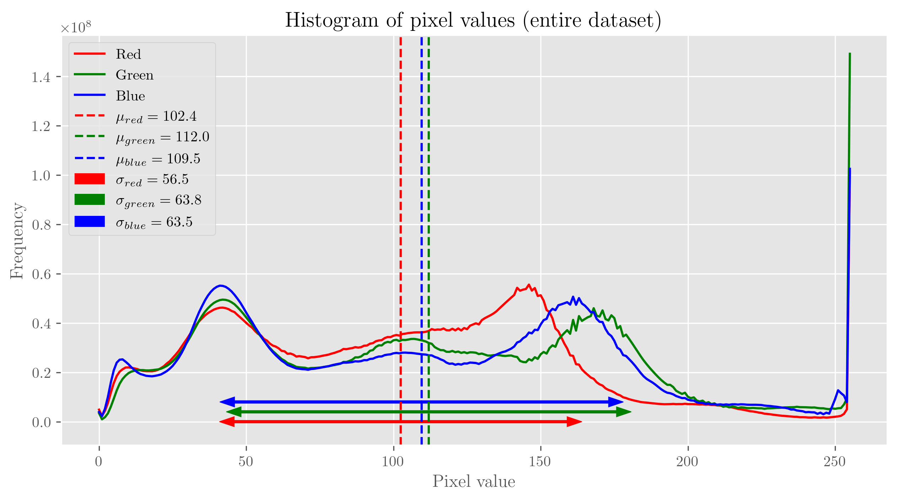
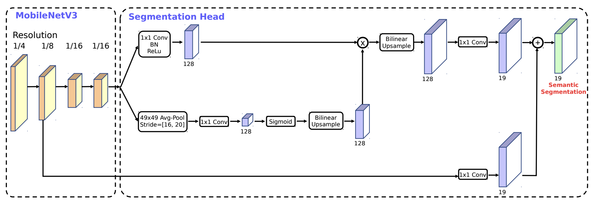
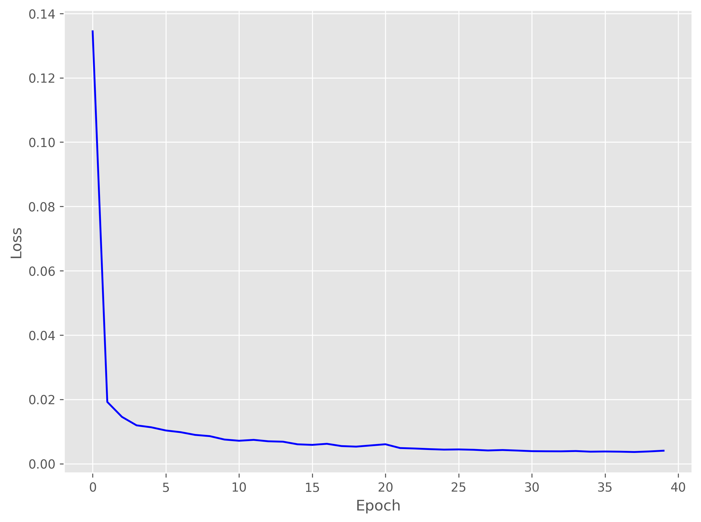
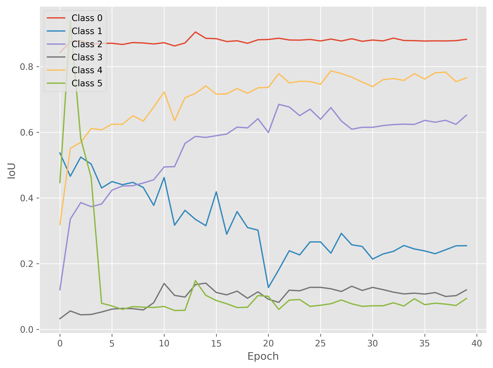
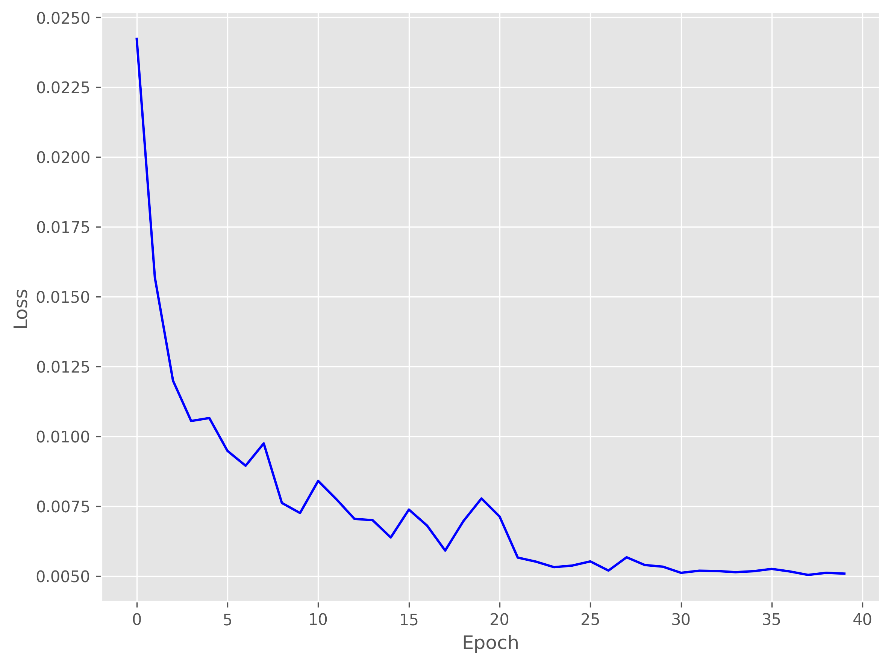
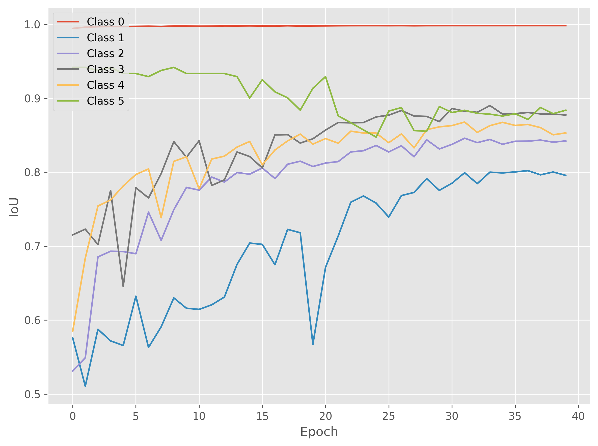

# MobileNet-based traffic cone segmentation

## 1. Introduction

This is our project for the FEE-CTU deep learning course [Learning for robotics](https://cw.fel.cvut.cz/b231/courses/b3b33urob/start).
We were solving the problem of semantically segmenting colored traffic cones used in the Formula Student Driverless competition such as these:

## 2. Dataset

For training and evaluating the models we used a publicly-available FS Cone segmentation dataset, derived from the main FSOCO object detection dataset. It is publicly available at https://www.fsoco-dataset.com/.

Because the original dataset is meant for instance segmentation and is distributed in the Supervisely format, we had to simplify and convert the data for easier use with simple semantic segmentation network.

We settled on the format $(C,H,W)$ for the segmentation mask where $C$ is the number of recognized classes. We classified into $5+1$ classes. The masks are stored as compressed numpy arrays in .npz files.
Class association is as follows:

0. background
1. orange cone
2. yellow cone
3. large orange cone
4. blue cone
5. unknown cone (marked in green)

You can download and process the dataset easily with `python make_dataset.py --workers [number of parallel workers]`

If you want to see the images and their corresponding segmentation masks, use the tool **DatasetExplorer** (call with `python dataset_explorer.py`).

## 3. Model

We used MobileNet V3-based segmentation models from the [FastSeg repository](https://github.com/ekzhang/fastseg) as our base. We modified the model to output 6 channels instead of 1 and trained it on our dataset. We were not using the pretrained weights, our models were trained from scratch. The models are implemeneted from the [Searching for MobileNetV3](https://arxiv.org/abs/1905.02244) paper.

Out final configuration used 256 filters and was trained on 1280x720 images.

## 4. Training

Our best final training setup used the following configuration (consult the `train_config.py` for more details):

  
<b>Configuration</b>

model_type: <class 'model.lraspp.MobileV3Small'>

model_kwargs: {'num_classes': 6, 'num_filters': 256, 'use_aspp': True}

optim_type: <class 'torch.optim.adam.Adam'>

optim_kwargs: {'lr': 0.001, 'weight_decay': 0.0}

scheduler_type: <class 'torch.optim.lr_scheduler.ReduceLROnPlateau'>

scheduler_kwargs: {'mode': 'min', 'factor': 0.5, 'patience': 2, 'verbose': True}

scheduler_requires_metric: True

loss_fn: <class 'torch.nn.modules.loss.CrossEntropyLoss'>

loss_kwargs: {'reduction': 'none', 'weight': None}

use_weighted_loss: False

loss_weight_fn: <function ClassDistrToWeight.sqrt_one_minus at 0x7f2ebad38ca0>

num_classes: 6

train_size: 0.7

val_size: 0.15

train_transforms: Compose(
    ClasswiseColorJitter({'class_transform_params': {0: {'hue': (-0.3, 0.3), 'saturation': (0.8, 1.2), 'brightness': (0.8, 1.2)}, 1: {'hue': (-0.5, 0.5), 'saturation': (0.3, 1.8), 'brightness': (0.5, 1.7)}, 2: {'hue': (-0.5, 0.5), 'saturation': (0.3, 1.8), 'brightness': (0.5, 1.7)}, 3: {'hue': (-0.5, 0.5), 'saturation': (0.3, 1.8), 'brightness': (0.5, 1.7)}, 4: {'hue': (-0.5, 0.5), 'saturation': (0.3, 1.8), 'brightness': (0.5, 1.7)}, 5: {'hue': (-0.5, 0.5), 'saturation': (0.3, 1.8), 'brightness': (0.5, 1.7)}}})
    RandomHorizontalFlipWithMask({'p': 0.5})
    RandomAffineWithMask({'degrees': 15, 'translate': (0.05, 0.05), 'scale': (0.8, 1.2), 'shear': 8})
    ResizeWithMask({'size': (720, 1280), 'antialias': True})
    Normalize({'mean': (131.2073, 149.7853, 145.0378), 'std': (42.621, 41.9638, 42.8229)})
)

eval_transforms: Compose(
    ResizeWithMask({'size': (720, 1280), 'antialias': True})
    Normalize({'mean': (131.2073, 149.7853, 145.0378), 'std': (42.621, 41.9638, 42.8229)})
)

seed: 42

data_path: fsoco_segmentation_processed

imdir: imgs

maskdir: masks

num_epochs: 40

device: cuda

train_loader_kwargs: {'pin_memory': True, 'persistent_workers': True, 'shuffle': True, 'num_workers': 8, 'batch_size': 16}

eval_loader_kwargs: {'pin_memory': True, 'persistent_workers': True, 'shuffle': False, 'num_workers': 8, 'batch_size': 16}

dataparallel: True

save_path: ./train_results

test_best: True

wandb_project: fsoco-segmentation

wandb_name: RCI_256_Small_NoDecay_IntenseAffineTransforms

## 5. Results

During training, we achieved relatively fast convergence of losses. However, our IoU metric did not converge well for all classes even though the final evaluation predictions were not bad. We suspect that the dataset is not balanced enough and the model is not able to learn the rare classes well, and sometimes bad labels are present.

We noted that it was very important to normalize the dataset using its mean and standard deviation.
We used multiple different augmentations, such as random mask-wise color jittering, affine transformations, and horizontal flips.

### Train loss

### Train IoU

### Val loss

### Val IoU

### Example predictions

